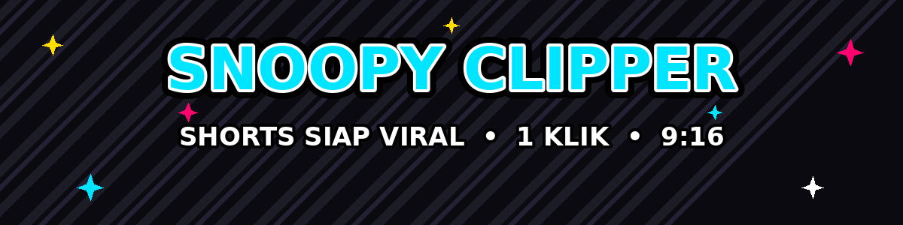

<div align="center">



**AI Web Clipper — 1 Otak Gemini · 1 Klik · Shorts 9:16 Siap Tayang**


<p>
  
  
  
</p>
<p>
  
  
  
  
  
  
</p>

> 🧪 **Tanpa PC pun bisa:** jalankan [`colab_test.ipynb`](colab_test.ipynb) di Google Colab — pipeline penuh + preview klip langsung.

</div>


## &nbsp; Kenapa Snoopy?

Klip yang terasa **dikerjakan editor, bukan dipotong robot.** Satu otak Gemini berpikir konteks-dulu memilih momen bermutu
(momen biasa ditolak), lalu mesin render profesional menggarapnya — potongan presisi kata, kamera sadar siapa yang bicara,
subtitle karaoke presisi, BGM mood-aware, loop alami, thumbnail wajib. Dibuat untuk **PC low-spec**: ETA jujur yang
mengkalibrasi diri dari kecepatan nyata PC-mu — makin lama makin akurat.


## &nbsp; Cara Pakai (30 Detik)

```bash
pip install -r requirements.txt
uvicorn backend.main:app --host 0.0.0.0 --port 8000
# buka http://localhost:8000 → tempel URL → klik GetClips → unduh shorts
```
Semua platform yang didukung yt-dlp: YouTube, TikTok, Instagram, X, Facebook — termasuk link **channel/profile**
(sistem memilih video terbaik otomatis). Video yang sama tak diproses dua kali (cache `downloads/`).


## &nbsp; Fitur Inti


| Fitur | Ringkas |
|---|---|
| 🧠 **Otak Gemini elite** | Konteks dulu → nilai seperti penonton → standar editor legendaris. Jumlah klip = keputusan otak, bukan kuota. |
| 🎥 **Kamera pembicara aktif v4** | Sadar UCAPAN (gerak mulut + Whisper), 1-10+ orang, transisi S-curve mulus, tanpa flip-flop. |
| 💬 **Subtitle v3.1** | Karaoke stabilo **presisi per-ms** + micro-lead 25ms + bounce tuntas per kata; ukuran auto-fit; teks bersih. |
| 🖥️ **Split Layer duo** | Frame terbelah atas-bawah (podcast + gameplay/demo) → subtitle **dobel** di tiap belahan, crossfade 120ms mulus. |
| 🔴 **Smart placement v4** | Tidak pernah menutupi wajah, UI platform (TikTok/Reels), teks bawaan video, dan area saliency. |
| ∞ **Loop alami** | Deteksi hook→isi→cliffhanger→bridge dari transkrip — tidak dipaksa, video datar tetap jadi klip normal. |
| 🎵 **BGM mood-aware** | Otak pilih mood per klip → BGM profesional tercampur halus. Kredit CC BY tampil otomatis di UI. |
| 🖼️ **Thumbnail wajib** | 4-lapis fallback (tak pernah gagal): wajah terbaik + ekspresi + ketajaman; teks khusus podcast + emoji topik. |
| 🎨 **Grade ultra + motion blur** | eq/hue/unsharp hasil benchmark CPU; blur hanya saat kamera pan — subtitle tetap tajam. |
| 📤 **Auto-post YouTube Shorts** | OAuth resmi Google, upload resumable, tombol Publish per klip di library. |
| 🧠 **5 Otak Spesialis (ops.)** | Tempel ≤5 kunci di `BRAIN_KEYS`: kurator/verifikator/penulis/direktur jalan **paralel** di kunci sendiri — atensi tak terbagi + verifikasi 2-tahap. Kosong = 1 otak (perilaku identik). |
| 👥 **Multi-user + billing** | Plan Free/Pro, kunci API per-user, kuota menit per plan. Midtrans (QRIS/GoPay/OVO/DANA/VA/kartu) **atau** mode manual transfer. |
| 🔐 **Login Google & email** | PBKDF2, tautan akun otomatis, anti-CSRF. `MULTIUSER=0` default = mode lokal lama utuh. |
| 🚦 **ETA realtime + pulih crash** | Kalibrasi drift dari kecepatan nyata; job basi pasca-restart jadi error jelas, bukan menggantung. |
| 📦 **Output pro** | MP4 9:16 1080x1920 (auto 720p), H.264+AAC, encoder GPU auto-detected. Docker siap VPS. |

<details>
<summary>📐 <b>Arsitektur singkat</b> (klik)</summary>

```
URL → downloader (yt-dlp, cookie fallback) → Whisper (words+lines) → frame sampler
    → OTAK Gemini (transkrip + frame → momen + judul + hook + mood + loop + layout)
    → per klip: face tracking → subtitle ASS v3.1 → render 1-pass ffmpeg
      (crop pintar + grade + blur + BGM + subtitle burn) → thumbnail → library
```
Mode lokal (default): satu server, tanpa login. Mode MULTIUSER=1: akun, kuota, billing aktif.
Log JSONL + `/api/stats` untuk observability. Detail lengkap: `backend/` (pipeline.py = orkestrator).
</details>


## &nbsp; Stack


<p>
  
  
  
  
  
</p>


## &nbsp; Konfigurasi Penting (.env)


| Variabel | Wajib? | Fungsi |
|---|---|---|
| `GEMINI_API_KEY` | ✅ | Otak — [gratis di aistudio.google.com](https://aistudio.google.com) |
| `MULTIUSER=1` + `ADMIN_EMAIL` | — | Aktifkan akun + kuota + billing (default 0 = mode lokal utuh) |
| `MIDTRANS_SERVER_KEY` | — | Pembayaran otomatis; **kosong = mode manual transfer** (jualan tetap jalan) |
| `YT_CLIENT_ID` / `YT_CLIENT_SECRET` | — | Auto-post YouTube + login Google (client OAuth yang sama) |
| `COOKIES_FROM_BROWSER` / `COOKIES_FILE` | — | Untuk video privat; fallback bertingkat otomatis |
| `PLAN_FREE_DAILY_MINUTES` / `PLAN_PRO_DAILY_MINUTES` / `PLAN_PRO_PRICE_IDR` | — | Tuning harga & kuota plan |

Lihat `.env.example` untuk daftar lengkap + komentar per baris.


## &nbsp; Deploy

- **VPS publik:** `docker compose up -d` — selesai. Daftarkan webhook Midtrans ke `https://domainmu/api/billing/midtrans-webhook` bila pakai pembayaran otomatis.
- **Google Colab:** buka `colab_test.ipynb` — clone + install + uji pipeline + preview klip.
- **Lokal low-spec:** cukup Python 3.11 + ffmpeg; Whisper jalan di CPU (`faster-whisper`).


## &nbsp; Roadmap

- [x] Subtitle v3.1 + Split Layer duo · Multi-user · Billing · Login Google
- [ ] Auto-post TikTok & Instagram (menunggu audit app TikTok / review Meta)
- [ ] Paket 90 hari + watermark opsional plan Free


## &nbsp; Lisensi


<div align="center">


</div>

**MIT** — bebas dipakai, dimodifikasi, dan dikomersialkan (jual SaaS pun bisa tanpa membuka kode modifikasimu).
Teks lengkap: [LICENSE](LICENSE). BGM bawaan berlisensi **CC BY 4.0** — kreditnya sudah otomatis tercantum di tiap klip.

## 💳 Plan Multi-User

| | 🆓 Free | ⭐ Pro |
|---|---|---|
| Kuota render | 30 menit/hari | **240 menit/hari** |
| Daging klip (voice -14 LUFS, karaoke v3.1, split layer, dead-air, hook, SFX) | ✅ | ✅ |
| Loop alami + BGM mood-aware + thumbnail | ✅ | ✅ |
| Auto-post YouTube Shorts | ✅ | ✅ |
| Watermark Snoopy | ✅ | ✅ |
| Dukungan | komunitas | **prioritas** |
| Harga | **Rp0** | **Rp150.000/bulan** |

Aktifkan: `MULTIUSER=1` + `ADMIN_EMAIL` di `.env`. Pembayaran: Midtrans (QRIS/GoPay/OVA/DANA/VA/kartu) — atau mode manual transfer bank tanpa gateway.

---

---

<div align="center">

**Snoopy Clipper** — dibuat dengan ❤️ oleh [jorsbanana-nexux](https://github.com/jorsbanana-nexux)

*Editor profesional, bukan clipper kaku.*


</div>
